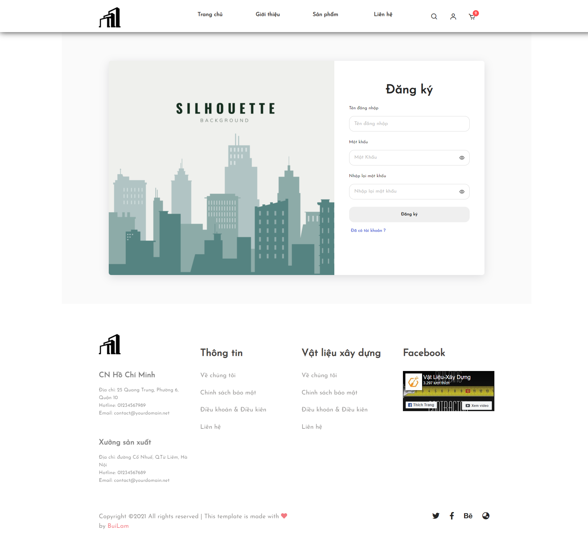
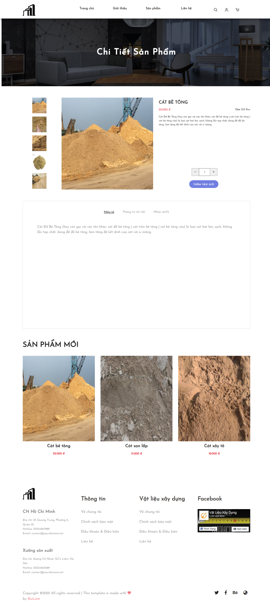

# building materials
To meet everyone's shopping needs during the epidemic season, a website selling building materials was created for shop owners and wishing to buy building materials online.


## Content
1. [Live demo](#live-demo)

1. [Sales ](#sales)
    1. [Login](#login)
    1. [Register an account](#register-an-account)
    1. [Home](#home)
    1. [About us](#about-us)
    1. [Product](#product)
    1. [Product details](#product-details)
    1. [Contact](#contact)
    1. [Shoping cart](#shoping-cart)
1. [Management](#management)
    1. [Login admin](#login-admin)
    1. [Category](#category)
    1. [Product admin](#product-admin)
    1. [Supplier](#supplier)
    1. [Invoice](#invoice)
    1. [Customer](#customer)
    1. [Employee](#employee)
1. [Libraries and technology](#libraries-and-technology)
1. [Author](#author)

## Live Demo
-  Live demo Web: [Building Materials](https://fronend-vlxd.vercel.app/)
-  Live demo Mobile app (F12 to view as mobile): [Building Materials Mobile](https://fronend-vlxd.vercel.app/)
-  Live demo Management: [Management](https://fronend-vlxd.vercel.app/main/login)
-  Backend: [Building Materials Backend](https://github.com/buingoclam147/DBVLXD)

## Setting

Use the package manager [npm](https://www.npmjs.com/) to install and run.

```bash
npm install
npm start
```
## Sales
### Login
* Login
   <p align="center">
   
   </p>
### Register an account
* Register an account
   <p align="center">
   
   </p>
### Home
* Home
   <p align="center">
   
   </p>
### About us
* About us
   <p align="center">
   
   </p>
### Product
* Product
   <p align="center">
   
   </p>
### Product details
* Product details
   <p align="center">
   
   </p>
### Contact
* Contact
   <p align="center">
   
   </p>
### Shoping cart
* Shoping cart
   <p align="center">
   
   </p>
   
## Management
### Login admin
* Login admin
   <p align="center">
   
   </p> 
### Category
* Category
   <p align="center">
   
   </p>
### Product admin
* Product admin
   <p align="center">
   
   </p>
### Supplier
* Supplier
   <p align="center">
   
   </p>
### Invoice
* Invoice
   <p align="center">
   
   </p>
### Customer
* Customer
   <p align="center">
   
   </p>
 ### Employee
* Employee
   <p align="center">
   
   </p>
## Device requirements
- Not support:

   + IE-10

## Libraries and technology

- Language : Typescript, Javascript, HTML, SCSS

- FrameWork : Angular, Nodejs, Express

- Database: MongoDB

   <p align="center">
   
   </p>
## Author

- Bùi Ngọc Lâm - buingoclam00@gmail.com
